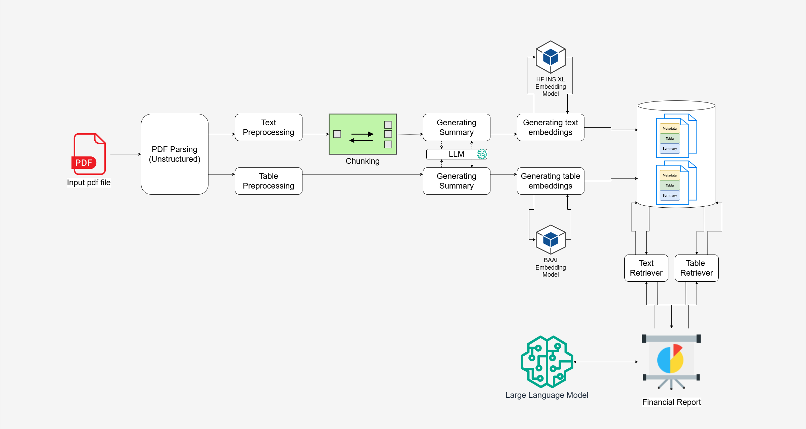

# 📚 Table of Contents

- [🧾 Introduction](#🧾-Introduction)
- [🏗️ System Architecture Overview](#🏗️-System-Architecture-Overview)
- [⚙️ System Setup](#⚙️-System-Setup)
- [📄 PDF Parsing](#📄-PDF-Parsing)
- [🧹 Text Preprocessing](#🧹-Text-Preprocessing)
- [📊 Table Preprocessing](#📊-Table-Preprocessing)
- [🧩 Chunking Mechanism](#🧩-Chunking-Mechanism)
- [✍️ Summarization](#✍️-Summarization)
- [🧠 Embedding & Storage](#🧠-Embedding--Storage)
- [🔎 Retrieval & Q&A](#🔎-Retrieval--QA)
- [📝 Report Generation](#📝-Report-Generation)
- [📌 Conclusion](#📌-Conclusion)


## 🧾 Introduction

Welcome to the **Financial PDF Analyzer** – a modular pipeline system designed to transform unstructured financial documents into structured, actionable insights.

This notebook walks through each phase of the pipeline:
<details>
<summary>📌 <strong>Pipeline Steps (Click to Expand)</strong></summary>

- 📄 **PDF Parsing**: Extrac text and tables from raw financial PDFs using [unstructured](https://docs.unstructured.io/welcome).
- 🔍 **Preprocessing**: Clean and prepare text and tabular data.
- 🧩 **Chunking**: Segment text into manageable, coherent blocks.
- ✍️ **Summarization**: Used [Gemini](https://ai.google.dev/gemini-api/docs/models) to summarize chunks.
- 🧠 **Embedding Generation**: Create text and table embeddings using [Hugging Face Instructor xl](https://huggingface.co/hkunlp/instructor-xl) and [BAAI model](https://huggingface.co/BAAI/bge-base-en-v1.5).
- 🗂️ **Vector Store**: Store embeddings and metadata in [ChromaDB](https://www.trychroma.com/).
- 📥 **Retrieval and Reporting**: Query and synthesize insights via LLM to produce financial summaries.

</details>

---

### 🔗 Key Technologies Used

- [LangChain](https://www.langchain.com/)
- [Chroma Vector Store](https://docs.trychroma.com/)
- [Instructor-XL Embedding Model](https://huggingface.co/hkunlp/instructor-xl)
- [Gemini](https://deepmind.google/technologies/gemini/)


```python

```

## 🧾 Introduction

The **Financial PDF Analyzer** is a pipeline-based system designed to transform unstructured financial documents into structured, actionable insights. This notebook walks through each step of the system, demonstrating how financial PDFs are processed, summarized, embedded, and ultimately used to generate concise reports.

The architecture follows a modular approach:

- 📄 **PDF Parsing**: Raw financial PDFs are parsed to extract both freeform text and structured tables.
- 🔍 **Preprocessing**: Separate pipelines clean and prepare text and tabular content.
- 🧩 **Chunking**: Text content is segmented into manageable chunks to support efficient processing.
- ✍️ **Summarization**: Each chunk is summarized using a Large Language Model to distill core insights.
- 🧠 **Embedding Generation**: Summarized chunks are embedded using the BAAI model to enable vector-based retrieval.
- 🗂️ **Vector Store**: Embeddings, summaries, and metadata are stored for downstream retrieval and analysis.
- 📥 **Retrieval and Reporting**: Relevant text and tables are retrieved and synthesized by an LLM to produce a final financial report.


```python

```

## 🏗️ System Architecture Overview

The **Financial PDF Analyzer** is designed as a modular pipeline, where each stage transforms data for the next. Here's an overview of the system flow:




```python
# importing libraries
import os
import json
from langchain.vectorstores import Chroma
from source.summary_generator import SummaryGenerator
from unstructured.staging.base import elements_from_json
from unstructured.staging.base import elements_to_json
from unstructured.partition.pdf import partition_pdf
from source.document_preprocessor import DocumentPreprocessor, Chunker
from source.financial_analysis_agent import FinancialAnalysisAgent
from source.multi_vector_store import TextVectorStoreBuilder, TableVectorStoreBuilder
from config import LANGSMITH_TRACING, LANGSMITH_ENDPOINT, PDF_FILE, CHUNK_SIZE, CHUNK_OVERLAP, LANGCHAIN_API_KEY, GEMINI_API_KEY, DATA_SAVE_PATH
```

---

### ⚙️ System Setup

The `config.py` file serves as a centralized system configuration.

- **API Keys**: Stores credentials for services like LangChain, LangSmith, and Gemini to ensure secure access to LLM and tracing functionalities.
- **Paths**: Defines file system locations for the input PDF, Chroma DB storage, and data output directories.
- **Model Configuration**: Sets the model names used for chatting, summarization, and embedding text/table data.
- **Chunking Settings**: Controls the `CHUNK_SIZE` and `CHUNK_OVERLAP` used in preprocessing and splitting document content.
- **Device Selection**: Allows specification of the device (CPU/GPU) for running embedding models efficiently.


---


📁 Creating an output directory based on the input PDF filename to store extracted and processed data.


```python
pdf_output_path = os.path.join(DATA_SAVE_PATH, PDF_FILE.split("/")[-1].replace(".pdf", ""))
if not os.path.exists(pdf_output_path):
    os.makedirs(pdf_output_path)
print(f"Outputs path: {pdf_output_path}")
```

    Outputs path: outputs/pfizer-report


**Data**: For development and testing, the Pfizer annual report [PFE-2022-Form-10K-FINAL (without Exhibits)](https://s28.q4cdn.com/781576035/files/doc_financials/2022/ar/PFE-2022-Form-10K-FINAL-(without-Exhibits).pdf) was used, which contains a total of 144 pages.


### 🧭 Optional: LangSmith Configuration

LangSmith is optionally integrated into the system to provide detailed tracing, debugging, and monitoring of LangChain workflows. This setup is especially valuable during development or for auditing model behaviors in production.

- **Tracing Enablement**: Controlled via the `LANGSMITH_TRACING` flag, which toggles tracing functionality.
- **API Configuration**: Uses `LANGSMITH_ENDPOINT` and `LANGCHAIN_API_KEY` to connect with the LangSmith service.
- **Use Cases**: Helps in visualizing execution chains, diagnosing failures, analyzing latency, and understanding prompt-response interactions.

This optional configuration is fully decoupled—developers can enable or disable it without affecting core functionality, making it a flexible addition for deeper observability.


```python
# Setting up Langsmith
os.environ["LANGSMITH_TRACING"] = LANGSMITH_TRACING
os.environ["LANGSMITH_ENDPOINT"] = LANGSMITH_ENDPOINT
os.environ["LANGSMITH_API_KEY"] = LANGCHAIN_API_KEY
```

## 📄 Step 1: Load PDF

In this step, the input PDF is parsed into a list of unstructured elements using `partition_pdf` from the `unstructured` library. These elements can include text blocks, titles, tables, and images.

### ⚙️ Key Parameters Used:
- `filename`: Path to the input PDF file.
- `strategy="hi_res"`: Uses a high-resolution layout detection model for better accuracy in identifying content structure.
- `extract_images_in_pdf=True`: Extracts images embedded within the PDF.
- `infer_table_structure=True`: Enables automatic detection and conversion of tables into structured formats (like HTML or CSV).
- `table_extraction_mode="lattice"`: Extracts tables using visible gridlines. (`"stream"` can be used for borderless, spacing-based tables).
- `skip_infer_table_types=[]`: Skips specific table types from inference (empty here, so all tables are considered).

📦 **Why Save as JSON?**  
The parsing process can be time-consuming, especially for large PDFs. Saving the extracted elements to a JSON file (`raw_unstructured_elements.json`) allows for faster reloads and avoids redundant parsing in future runs.


```python
# 1. Load PDFs
print("Loading PDF...")

pdf_elements = partition_pdf(
        filename=PDF_FILE,
        strategy="hi_res",
        extract_images_in_pdf=True,
        infer_table_structure=True, # Detects and extracts tables into structured formats (e.g., HTML, CSV-like).
        table_extraction_mode="lattice",  # Detects tables with clear grid lines. or "stream" for Detects tables without borders (spacing-based).
        skip_infer_table_types=[],
    )

print(f"Total elements: {len(pdf_elements)}")

# Saving to JSON file
_ = elements_to_json(pdf_elements, filename=os.path.join(pdf_output_path, "raw_unstructured_elements.json"))
```

    Loading PDF...
    Total elements: 1935


```python
# Load elements from JSON
pdf_elements = elements_from_json(os.path.join(pdf_output_path, "raw_unstructured_elements.json"))
print(f"Total elements: {len(pdf_elements)}")
```

    Total elements: 1935


📌 Extracted and categorized various element types (e.g., text, titles, tables, images) from the PDF to understand its content structure.


```python
# Create a dictionary to store counts of each type
category_counts = {}

for element in pdf_elements:
    category = str(type(element))
    if category in category_counts:
        category_counts[category] += 1
    else:
        category_counts[category] = 1

# Unique_categories will have unique elements
unique_categories = set(category_counts.keys())
category_counts
```


    {"<class 'unstructured.documents.elements.Header'>": 27,
     "<class 'unstructured.documents.elements.Title'>": 343,
     "<class 'unstructured.documents.elements.NarrativeText'>": 882,
     "<class 'unstructured.documents.elements.Image'>": 12,
     "<class 'unstructured.documents.elements.Table'>": 98,
     "<class 'unstructured.documents.elements.Text'>": 124,
     "<class 'unstructured.documents.elements.ListItem'>": 428,
     "<class 'unstructured.documents.elements.FigureCaption'>": 20,
     "<class 'unstructured.documents.elements.Formula'>": 1}


## 🧹 Step 2: Preprocessing of Text and Table Elements

The preprocessing step transforms raw PDF elements into clean, structured text and table chunks:

- **Textual Preprocessing**: Groups together contiguous headers, titles, and text-like elements (narrative, list items, formulas, etc.) while preserving their order and associated metadata.
- **Table Handling**: Detects tables and converts them into HTML format for structure retention, storing them with their own metadata.
- **Metadata Aggregation**: Merges metadata like page numbers, languages, and element types for each chunk, making the data searchable and analyzable later.
- **Output**: The result is a list of `Element` objects categorized into `text_elements` and `table_elements`, ready for chunking or embedding.


```python
# 2. Splitting text into chunks
print("Splitting text into chunks...")
preprocessor = DocumentPreprocessor(pdf_elements)

# Preprocessing include appending element's text by type, tables as html text and creating metadata accordingly
elements = preprocessor.preprocess_as_html() 
text_elements, table_elements = preprocessor.split_by_type()
print(f"Processed text elements count: {len(text_elements)}")
print(f"Processed table elements count: {len(table_elements)}")
```

    Splitting text into chunks...
    Processed text elements count: 384
    Processed table elements count: 98


### 🔗 Step 3: Chunking Text Elements

In this step, large preprocessed text blocks are split into smaller chunks using a token-based approach:

- **Chunking Strategy**: The `Chunker` class breaks down long text into manageable pieces based on a predefined token limit (`CHUNK_SIZE`) with optional overlap (`CHUNK_OVERLAP`) to preserve context across chunks.
- **Metadata Preservation**: During chunking, relevant metadata is merged and attached to each chunk to retain traceability.
- **Result**: The `text_chunks` contain segmented text ready for embedding or further processing, while `table_chunks` are retained as-is without further splitting.


```python
# Splitting text chunks and maintaining metadata acc. 
chunker = Chunker(chunk_size=CHUNK_SIZE, overlap=CHUNK_OVERLAP)
text_chunks = chunker.chunk_elements(text_elements) # chunking only text elements

table_chunks = table_elements

print(f"Text chunks count: {len(text_chunks)}")
print(f"Table chunks count: {len(table_chunks)}")
```

    Text chunks count: 107
    Table chunks count: 98


```python
# Sample text chunk
print(text_chunks[10])
```

    type='text' text="OPERATIONS</td><td>25</td></tr><tr><td>ITEM 7A. QUANTITATIVE AND QUALITATIVE DISCLOSURES ABOUT MARKET RISK</td><td>44</td></tr><tr><td>ITEM 8. FINANCIAL STATEMENTS AND SUPPLEMENTARY DATA</td><td>45</td></tr><tr><td>ITEM 9. CHANGES IN AND DISAGREEMENTS WITH ACCOUNTANTS ON ACCOUNTING AND FINANCIAL DISCLOSURE</td><td>101</td></tr><tr><td>ITEM 9A. CONTROLS AND PROCEDURES</td><td>101</td></tr><tr><td>ITEM 9B. OTHER INFORMATION</td><td>N/A</td></tr><tr><td>ITEM 9C. DISCLOSURE REGARDING FOREIGN JURISDICTIONS THAT PREVENT INSPECTIONS</td><td>N/A</td></tr><tr><td>PART Ill</td><td>104</td></tr><tr><td>ITEM 10. DIRECTORS, EXECUTIVE OFFICERS AND CORPORATE GOVERNANCE</td><td>104</td></tr><tr><td>ITEM 11. EXECUTIVE COMPENSATION</td><td>104</td></tr><tr><td>ITEM 12. SECURITY OWNERSHIP OF CERTAIN BENEFICIAL OWNERS AND MANAGEMENT AND RELATED STOCKHOLDER MATTERS.</td><td>104</td></tr><tr><td>ITEM 13. CERTAIN RELATIONSHIPS AND RELATED TRANSACTIONS, AND DIRECTOR INDEPENDENCE</td><td>104</td></tr><tr><td>ITEM 14. PRINCIPAL ACCOUNTING FEES AND SERVICES</td><td>104</td></tr><tr><td>PART IV</td><td>104</td></tr><tr><td>ITEM 15. EXHIBITS, FINANCIAL STATEMENT SCHEDULES.</td><td>104</td></tr><tr><td>15(a)(1) Financial Statements</td><td>104</td></tr><tr><td>15(a)(2) Financial Statement Schedules</td><td>104</td></tr><tr><td>15(a)(3) Exhibits</td><td>104</td></tr><tr><td>ITEM 16. FORM 10-K SUMMARY</td><td>108</td></tr><tr><td>SIGNATURES</td><td>109</td></tr><tr><td>N/A = Not Applicable</td><td></td></tr></tbody></table></TB>[P2] <NT>Unless the context requires otherwise, references to “Pfizer, ‘the Company,” “we, us” or “our” in this Form 10-K (defined below) refer to Pfizer</NT>[P3] <TB><table><thead><tr><th>his Form 10-K. We also have</th><th>used several other terms in this Form 10-K, most of which are explained or defined below:</th></tr><tr><th>Form 10-K 2021 Form 10-K</th><th>This Annual Report on Form 10-K for the fiscal year ended December 31, 2022 Form 10-K for the fiscal ended December 2021</th></tr></thead><tbody><tr><td>Proxy Statement</td><td>Our Annual Report on year 31, Proxy Statement for the 2023 Annual Meeting of Shareholders, which will be filed no later than 120 days after</td></tr><tr><td></td><td>December 31, 2022</td></tr><tr><td>AbbVie ABO</td><td>AbbVie Inc. Accumulated benefit obligation; represents the present value of the benefit obligation earned through the end</td></tr><tr><td>ACIP</td><td>of the year but does not factor in future compensation increases Committee Immunization Practices</td></tr><tr><td></td><td>Advisory on</td></tr><tr><td>ALK Alliance revenues</td><td>anaplastic lymphoma kinase Revenues from alliance agreements under which we co-promote products discovered or developed by other</td></tr><tr><td>Arena</td><td>companies or us Arena Inc.</td></tr><tr><td></td><td>Pharmaceuticals,</td></tr><tr><td>Array</td><td>Array BioPharma Inc.</td></tr><tr><td>Arvinas</td><td>Arvinas, Inc.</td></tr><tr><td>Astellas</td><td>Astellas Pharma Inc., Astellas US LLC and Astellas Pharma US, Inc.</td></tr><tr><td>ATTR-CM</td><td></td></tr><tr><td></td><td>transthyretin amyloid cardiomyopathy</td></tr><tr><td>Beam</td><td>Beam Therapeutics Inc.</td></tr><tr><td>Biohaven</td><td>Biohaven Pharmaceutical Holding Company Ltd.</td></tr><tr><td>BioNTech</td><td>BioNTech SE</td></tr><tr><td></td><td>Global Biopharmaceuticals Business</td></tr><tr><td>Biopharma</td><td></td></tr><tr><td>BLA</td><td>Biologics License Application</td></tr><tr><td>BMS</td><td>Bristol-Myers Squibb Company</td></tr><tr><td>BOD</td><td>Board of Directors</td></tr><tr><td>CDC</td><td>U.S. Centers for Disease Control and Prevention</td></tr><tr><td>cGMP</td><td>current Good Manufacturing Practices</td></tr><tr><td>CGRP</td><td>calcitonin gene-related peptide</td></tr><tr><td>CMA</td><td>conditional marketing authorisation</td></tr><tr><td>CMS</td><td>Centers for Medicare &amp; Medicaid Services</td></tr><tr><td>Comirnaty*</td><td>Unless otherwise noted, refers to, as applicable, and as authorized or approved, the Pfizer-BioNTech COVID-19 Vaccine, the Pfizer-BioNTech COVID-19 Vaccine, Bivalent (Original and Omicron BA.4/BA.5), the Comirnaty Original/Omicron BA.1 Vaccine, and Comirnaty Original/Omicron BA.4/BA.5 Vaccine</td></tr><tr><td>Cond. J-NDA</td><td>Conditional Japan New Drug Application</td></tr><tr><td>Consumer Healthcare JV</td><td>GSK Consumer Healthcare JV</td></tr><tr><td>COVID-19</td><td>novel coronavirus disease of 2019</td></tr><tr><td>CStone</td><td>CStone Pharmaceuticals</td></tr><tr><td>DEA</td><td>U.S. Drug Enforcement Agency</td></tr><tr><td>Developed Europe</td><td>Includes the following markets: Western Europe, Scandinavian countries and Finland</td></tr><tr><td>Developed Markets</td><td>Includes the following markets: U.S., Developed Europe, Japan, Canada, South Korea, Australia and New Zealand</td></tr><tr><td>Developed Rest of World</td><td>Includes the following markets: Japan, Canada, South Korea, Australia and New Zealand</td></tr><tr><td>EC</td><td>European Commission</td></tr><tr><td>EMA</td><td>European Medicines Agency</td></tr><tr><td>Emerging Markets</td><td>Includes, but is not limited to, the following markets: Asia (excluding Japan and South Korea), Latin America, Central Europe, Eastern Europe, the Middle East, Africa and Turkey</td></tr><tr><td>EPS</td><td>earnings per share</td></tr><tr><td>ESG</td><td>Environmental, Social and Governance</td></tr></tbody></table></TB>[P3] <T>ESOP</T>[P3] <T>EU</T>[P3] <T>employee stock ownership plan European Union</T>[P3] <T>EUA</T>[P3] <T>Exchange Act FASB</T>[P3] <T>FCPA</T>[P3] <T>FDA</T>[P3] <T>FFDCA GAAP. GBT</T>[P3] <TX>emergency use authorization Securities Exchange Act of 1934, as amended Financial Accounting Standards Board U.S. Foreign Corrupt Practices Act U.S. Food and Drug Administration U.S. Federal Food, Drug and Cosmetic Act Generally Accepted Accounting Principles Global Blood Therapeutics, Inc. grant-date fair value</TX>[P3] <T>GDFV</T>[P3] <NT>2022 Form 10-K</NT>[P3] <TB><table><thead><tr><th>GPD</th><th>Global Product Development organization</th></tr></thead><tbody><tr><td>GSK</td><td>GlaxoSmithKline plc</td></tr><tr><td>Haleon</td><td>Haleon plc</td></tr><tr><td>HHS</td><td>U.S. Department of Health and Human Services</td></tr><tr><td>HIPAA</td><td>Health Insurance Portability and Accountability Act of 1996</td></tr><tr><td>Hospira</td><td>Hospira, Inc.</td></tr><tr><td>IPR&amp;D</td><td>in-process research and development</td></tr><tr><td>IRA</td><td>Inflation Reduction Act of 2022</td></tr><tr><td>IRC</td><td>Internal Revenue Code</td></tr><tr><td>IRS</td><td>U.S. Internal Revenue Service</td></tr><tr><td>IT</td><td>information technology</td></tr><tr><td>JAK</td><td>Janus kinase</td></tr><tr><td>JV</td><td>joint venture</td></tr><tr><td>King</td><td>King Pharmaceuticals LLC (formerly King Pharmaceuticals, Inc.)</td></tr><tr><td>LIBOR</td><td>London Interbank Offered Rate</td></tr><tr><td>Lilly</td><td>Eli Lilly and Company</td></tr><tr><td>LOE</td><td>loss of exclusivity</td></tr><tr><td>MCO</td><td></td></tr><tr><td></td><td>managed care organization</td></tr><tr><td>mCRC</td><td>metastatic colorectal cancer</td></tr><tr><td>mCRPC</td><td>metastatic castration-resistant prostate cancer</td></tr><tr><td>mCSPC</td><td>metastatic castration-sensitive prostate cancer</td></tr><tr><td>MD&amp;A</td><td>Management's Discussion and Analysis of Financial Condition and Results of Operations</td></tr><tr><td>MDL</td><td>Multi-District Litigation</td></tr><tr><td>Medivation</td><td>Medivation LLC (formerly Medivation, Inc.)</td></tr><tr><td>Meridian</td><td>Meridian Medical Technologies, Inc.</td></tr><tr><td>Moody's</td><td>Moody’s Investors Service</td></tr><tr><td>mRNA</td><td>messenger ribonucleic acid</td></tr><tr><td>MSA</td><td>Manufacturing Supply Agreement</td></tr><tr><td>MTM</td><td>mark-to-market</td></tr><tr><td>MTM change in accounting</td><td>In the first quarter of 2021, we adopted a change in accounting principle to a more preferable policy under</td></tr><tr><td>principle</td><td>U.S. GAAP to immediately recognize actuarial gains and losses arising from the remeasurement of our pension and postretirement plans (MTM Accounting).</td></tr><tr><td>Mylan</td><td>Mylan N.V.</td></tr><tr><td>Mylan-Japan collaboration</td><td>a pre-existing strategic collaboration between Pfizer and Mylan for generic drugs in Japan that terminated on</td></tr><tr><td></td><td>December 21, 2020</td></tr><tr><td>Myovant</td><td>Myovant Sciences Ltd.</td></tr><tr><td></td><td></td></tr><tr><td>NAV</td><td>net asset value</td></tr><tr><td>NDA</td><td>new drug application</td></tr><tr><td>nmCRPC</td><td>non-metastatic castration-resistant prostate cancer</td></tr><tr><td>NSCLC</td><td>non-small cell lung cancer</td></tr><tr><td>NYSE</td><td>New York Stock Exchange</td></tr><tr><td>Ono</td><td>Ono Pharmaceutical Co., Ltd.</td></tr><tr><td>OPKO</td><td>OPKO Health, Inc.</td></tr><tr><td>OTC</td><td>over-the-counter</td></tr><tr><td>Paxlovid*</td><td>an oral COVID-19 treatment (nirmatrelvir [PF-07321332] tablets and ritonavir tablets)</td></tr><tr><td>PBM</td><td>pharmacy benefit manager</td></tr><tr><td>PBO</td><td>Projected benefit obligation; represents the present value of the benefit obligation earned through the end of the year and factors in future compensation increases</td></tr><tr><td>PC1</td><td>Pfizer CentreOne</td></tr><tr><td>PGS</td><td>Pfizer Global Supply</td></tr></tbody></table></TB>[P4] <T>PRAC</T>[P4] <T>Prevnar family</T>[P4] <TX>Pharmacovigilance Risk Assessment Committee Includes Prevnar 13/Prevenar 13 (pediatric and adult) and Prevnar 20 (adult)</TX>[P4] <T>PsA</T>[P4] <T>QCE</T>[P4] <T>RA</T>[P4] <T>psoriatic arthritis quality consistency evaluation rheumatoid arthritis</T>[P4] <T>RCC</T>[P4] <T>renal cell carcinoma</T>[P4] <T>R&D ReViral ROU</T>[P4] <T>S&P</T>[P4] <T>research and development</T>[P4] <T>ReViral Ltd.</T>[P4] <T>right of use Standard & Poor’s</T>[P4] <T>SEC SI&A</T>[P4] <T>U.S. Securities and Exchange Commission selling, informational and administrative</T>[P4] <TX>2022 Form 10-K</TX>[P4] <TB><table><tbody><tr><td>sNDA Tax Cuts and Jobs Act or TCJA</td><td>supplemental new drug application Legislation commonly referred to as the U.S. Tax Cuts and Jobs Act of 2017</td></tr><tr><td>Trillium</td><td>Trillium Therapeutics Inc.</td></tr><tr><td>TSAs</td><td>transition service arrangements</td></tr><tr><td>UC</td><td>ulcerative colitis</td></tr><tr><td>U.K.</td><td>United Kingdom</td></tr><tr><td>Upjohn Business</td><td>Pfizer's former global, primarily off-patent branded and generics business, which included a portfolio of 20 globally recognized solid oral dose brands, including Lipitor, Lyrica, Norvasc, Celebrex and Viagra, as well as a U.S.-based generics platform, Greenstone, that was spun-off on November 16, 2020 and combined with Mylan to create Viatris</td></tr><tr><td>U.S.</td><td>United States</td></tr><tr><td>Valneva</td><td>Valneva SE</td></tr><tr><td>VBP</td><td>volume-based procurement</td></tr><tr><td>Viatris</td><td>Viatris Inc.</td></tr><tr><td>ViiV</td><td>ViiV Healthcare Limited</td></tr><tr><td>Vyndagel family</td><td>Includes Vyndagel, Vyndamax and Vynmac</td></tr><tr><td>WRDM</td><td>Worldwide Research, Development and Medical</td></tr></tbody></table></TB>[P5]" metadata={'source_type': 'text', 'languages': 'eng'}


```python
# Sample table chunk
print(table_chunks[10])
```

    type='table' text='<table><thead><tr><th>2022</th><th></th><th>$100.3</th></tr></thead><tbody><tr><td>2020</td><td>$41.7</td><td></td></tr></tbody></table>' metadata={'languages': 'eng', 'page_number': 31}


### 📄 Step 4: Summarizing Text and Table Elements

In this step, the content from the financial PDF is summarized:

- **Text and Table Summarization**: Textual data and tables are processed and summarized separately.
  
- **Using Gemini API**: The `SummaryGenerator` class uses the Google Gemini API to generate summaries for each chunk of text and table content.
  
- **Saving Summaries**: The summaries are saved as JSON files (`text_summaries.json` and `table_summaries.json`) for future use.


```python
# 3. Multi-Vetor Retriever

# Initialize summarizer
summarizer = SummaryGenerator(api_key=GEMINI_API_KEY)

# Getting summaries
text_summaries = summarizer.summarize_chunks(text_chunks, label="text")
table_summaries = summarizer.summarize_chunks(table_chunks, label="table")

# Saving to file
with open(os.path.join(pdf_output_path, "text_summaries.json"), "w") as f:
    json.dump(text_summaries, f)
    
with open(os.path.join(pdf_output_path, "table_summaries.json"), "w") as f:
    json.dump(table_summaries, f)
```

    Summarizing text #0
    Summarizing text #1
    Summarizing text #2
    Summarizing text #3
    Summarizing text #4
    Summarizing text #5
    Summarizing text #6
    Summarizing text #7
    Summarizing text #8
    Summarizing text #9
    Summarizing text #10
    Summarizing text #11
    Summarizing text #12
    Summarizing text #13
    Summarizing text #14
    Summarizing text #15
    Summarizing text #16
    Summarizing text #17
    Summarizing text #18
    Summarizing text #19
    Summarizing text #20
    Summarizing text #21
    Summarizing text #22
    Summarizing text #23
    Summarizing text #24
    Summarizing text #25
    Summarizing text #26
    Summarizing text #27
    Summarizing text #28
    Summarizing text #29
    Summarizing text #30
    Summarizing text #31
    Summarizing text #32
    Summarizing text #33
    Summarizing text #34
    Summarizing text #35
    Summarizing text #36
    Summarizing text #37
    Summarizing text #38
    Summarizing text #39
    Summarizing text #40
    Summarizing text #41
    Summarizing text #42
    Summarizing text #43
    Summarizing text #44
    Summarizing text #45
    Summarizing text #46
    Summarizing text #47
    Summarizing text #48
    Summarizing text #49
    Summarizing text #50
    Summarizing text #51
    Summarizing text #52
    Summarizing text #53
    Summarizing text #54
    Summarizing text #55
    Summarizing text #56
    Summarizing text #57
    Summarizing text #58
    Summarizing text #59
    Summarizing text #60
    Summarizing text #61
    Summarizing text #62
    Summarizing text #63
    Summarizing text #64
    Summarizing text #65
    Summarizing text #66
    Summarizing text #67
    Summarizing text #68
    Summarizing text #69
    Summarizing text #70
    Summarizing text #71
    Summarizing text #72
    Summarizing text #73
    Summarizing text #74
    Summarizing text #75
    Summarizing text #76
    Summarizing text #77
    Summarizing text #78
    Summarizing text #79
    Summarizing text #80
    Summarizing text #81
    Summarizing text #82
    Summarizing text #83
    Summarizing text #84
    Summarizing text #85
    Summarizing text #86
    Summarizing text #87
    Summarizing text #88
    Summarizing text #89
    Summarizing text #90
    Summarizing text #91
    Summarizing text #92
    Summarizing text #93
    Summarizing text #94
    Summarizing text #95
    Summarizing text #96
    Summarizing text #97
    Summarizing text #98
    Summarizing text #99
    Summarizing text #100
    Summarizing text #101
    Summarizing text #102
    Summarizing text #103
    Summarizing text #104
    Summarizing text #105
    Summarizing text #106
    Summarizing table #0
    Summarizing table #1
    Summarizing table #2
    Summarizing table #3
    Summarizing table #4
    Summarizing table #5
    Summarizing table #6
    Summarizing table #7
    Summarizing table #8
    Summarizing table #9
    Summarizing table #10
    Summarizing table #11
    Summarizing table #12
    Summarizing table #13
    Summarizing table #14
    Summarizing table #15
    Summarizing table #16
    Summarizing table #17
    Summarizing table #18
    Summarizing table #19
    Summarizing table #20
    Summarizing table #21
    Summarizing table #22
    Summarizing table #23
    Summarizing table #24
    Summarizing table #25
    Summarizing table #26
    Summarizing table #27
    Summarizing table #28
    Summarizing table #29
    Summarizing table #30
    Summarizing table #31
    Summarizing table #32
    Summarizing table #33
    Summarizing table #34
    Summarizing table #35
    Summarizing table #36
    Summarizing table #37
    Summarizing table #38
    Summarizing table #39
    Summarizing table #40
    Summarizing table #41
    Summarizing table #42
    Summarizing table #43
    Summarizing table #44
    Summarizing table #45
    Summarizing table #46
    Summarizing table #47
    Summarizing table #48
    Summarizing table #49
    Summarizing table #50
    Summarizing table #51
    Summarizing table #52
    Summarizing table #53
    Summarizing table #54
    Summarizing table #55
    Summarizing table #56
    Summarizing table #57
    Summarizing table #58
    Summarizing table #59
    Summarizing table #60
    Summarizing table #61
    Summarizing table #62
    Summarizing table #63
    Summarizing table #64
    Summarizing table #65
    Summarizing table #66
    Summarizing table #67
    Summarizing table #68
    Summarizing table #69
    Summarizing table #70
    Summarizing table #71
    Summarizing table #72
    Summarizing table #73
    Summarizing table #74
    Summarizing table #75
    Summarizing table #76
    Summarizing table #77
    Summarizing table #78
    Summarizing table #79
    Summarizing table #80
    Summarizing table #81
    Summarizing table #82
    Summarizing table #83
    Summarizing table #84
    Summarizing table #85
    Summarizing table #86
    Summarizing table #87
    Summarizing table #88
    Summarizing table #89
    Summarizing table #90
    Summarizing table #91
    Summarizing table #92
    Summarizing table #93
    Summarizing table #94
    Summarizing table #95
    Summarizing table #96
    Summarizing table #97


```python
# Loading summaries
with open(os.path.join(pdf_output_path, "text_summaries.json"), "r") as f:
    text_summaries = json.load(f)
    
with open(os.path.join(pdf_output_path, "table_summaries.json"), "r") as f:
    table_summaries = json.load(f)
```


```python
print(f"Text chunks length: {len(text_chunks)}")
print(f"Text summaries length: {len(text_summaries)}")

print(f"Table chunks length: {len(table_chunks)}")
print(f"Table summaries length: {len(table_summaries)}")
```

    Text chunks length: 107
    Text summaries length: 107
    Table chunks length: 98
    Table summaries length: 98


### 🧠 Step 5: Storing Summarized Chunks in Chroma Vector Database

This step stores the summarized text and table chunks into Chroma DB for semantic search and retrieval:

- **Persistence Setup**: 
  - Separate directories are created for storing text and table embeddings (`embeddings/chroma_text` and `embeddings/chroma_table`).


```python
# Presist directory
text_pdir = os.path.join(pdf_output_path, "embeddings/chroma_text")
table_pdir = os.path.join(pdf_output_path, "embeddings/chroma_table")

if not os.path.exists(text_pdir):
    os.makedirs(text_pdir)
if not os.path.exists(table_pdir):
    os.makedirs(table_pdir)
```

- **Vector Store Creation**: 
  - The `TextVectorStoreBuilder` and `TableVectorStoreBuilder` classes build vector stores using Hugging Face and  embedding models.
  - Each chunk is converted into a `Document` object containing the original content and its corresponding summary as metadata.
  - These documents are embedded and stored in Chroma DB using `Chroma.from_documents()`.


```python
# Storing texts to vector DB
text_builder = TextVectorStoreBuilder(text_pdir)
text_store, text_retriever = text_builder.build_store_and_retriever(text_chunks, text_summaries)
```

    c:\Financial_PDF_Analyzer\source\multi_vector_store.py:12: LangChainDeprecationWarning: The class `HuggingFaceEmbeddings` was deprecated in LangChain 0.2.2 and will be removed in 1.0. An updated version of the class exists in the :class:`~langchain-huggingface package and should be used instead. To use it run `pip install -U :class:`~langchain-huggingface` and import as `from :class:`~langchain_huggingface import HuggingFaceEmbeddings``.
      self.embedding_model = HuggingFaceEmbeddings(


```python
# Storing tables to vector DB
table_builder = TableVectorStoreBuilder(table_pdir)
table_store, table_retriever = table_builder.build_store_and_retriever(table_chunks, table_summaries)
```


- **Retriever Configuration**: 
  - A retriever is created from each Chroma store using **MMR (Maximal Marginal Relevance)** to balance relevance and diversity in search results.
  - The retrievers are configured with custom `lambda_mult` values and return the top 5 results (`k=5`).

- **Output**:
  - Two retrievers (`text_retriever` and `table_retriever`) are initialized for querying textual and tabular content respectively from the stored embeddings.


```python
# Loading text retriever
text_builder = TextVectorStoreBuilder(text_pdir)
text_store = Chroma(
    persist_directory=text_pdir,
    embedding_function=text_builder.embedding_model
)

text_retriever = text_builder.get_retriever(text_store)
```

    c:\Financial_PDF_Analyzer\source\multi_vector_store.py:12: LangChainDeprecationWarning: The class `HuggingFaceEmbeddings` was deprecated in LangChain 0.2.2 and will be removed in 1.0. An updated version of the class exists in the :class:`~langchain-huggingface package and should be used instead. To use it run `pip install -U :class:`~langchain-huggingface` and import as `from :class:`~langchain_huggingface import HuggingFaceEmbeddings``.
      self.embedding_model = HuggingFaceEmbeddings(
    C:\Users\ankra\AppData\Local\Temp\ipykernel_9356\607498215.py:3: LangChainDeprecationWarning: The class `Chroma` was deprecated in LangChain 0.2.9 and will be removed in 1.0. An updated version of the class exists in the :class:`~langchain-chroma package and should be used instead. To use it run `pip install -U :class:`~langchain-chroma` and import as `from :class:`~langchain_chroma import Chroma``.
      text_store = Chroma(


```python
# Loading table retriever
table_builder = TableVectorStoreBuilder(table_pdir)
table_store = Chroma(
            embedding_function=table_builder.embedding_model,
            persist_directory=table_pdir,
        )

table_retriever = table_builder.get_retriever(table_store)
```

### 📊 Step 6: Generating the Financial Analysis Report

This step creates a comprehensive markdown report summarizing key insights from the financial PDF:

- **Agent Setup**:  
  - The `FinancialAnalysisAgent` is initialized with retrievers for both text and table embeddings.
  - It uses Google’s Gemini chat model to generate report content.

- **Section-wise Reporting**:  
  - A predefined set of financial topics (e.g., Executive Summary, Revenue & Profit Trends, Liquidity & Solvency) guides the structure of the report.
  - For each topic, relevant chunks are retrieved from the vector stores using the corresponding query.

- **LLM-Powered Generation**:  
  - The context (retrieved content) is passed to the language model with a tailored prompt to generate markdown-formatted analysis.
  - Each section includes titles and attempts to reference metadata such as page numbers.

- **Output**:  
  - All generated sections are combined into a single markdown report (`Financial_Analysis_Report.md`) and saved to disk.


```python
# 5. Run Financial Analysis
print("\nRunning Financial Analysis...")
agent = FinancialAnalysisAgent(text_retriever, table_retriever)

full_report = agent.generate_full_report()
print("\n=== Executive Summary Report ===")
with open(os.path.join(pdf_output_path, "Financial_Analysis_Report.md"), "w", encoding="utf-8") as f:
    f.write(full_report)
print("Report saved at",  os.path.join(pdf_output_path, "Financial_Analysis_Report.md"))

```

    
    Running Financial Analysis...
    
    ## Executive Summary
    
    * **Total Revenues:** $100.3 billion in 2022 (a 23% increase from 2021) (p. 31)
    * **Net Cash Flow from Operations:** $29.3 billion in 2022 (a 10% decrease from 2021) (p. 31)
    * **Reported Diluted EPS:** $5.47 in 2022 (a 42% increase from 2021) (p. 31)
    * **Adjusted Diluted EPS (Non-GAAP):** $6.58 in 2022 (a 62% increase from 2021) (p. 31)
    * **Strategic Actions:** Spin-off of Upjohn and sale of Meridian (p. 31).  Restructuring since 2019 resulted in a more focused structure with Biopharma as the only reportable operating segment (p. 31).  Further organizational changes in 2022 aimed to optimize operations and R&D (p. 31).
    
    
    
    ## Executive Summary
    
    * **Total Revenues:** $100.3 billion in 2022 (a 23% increase from 2021) (p. 31)
    * **Net Cash Flow from Operations:** $29.3 billion in 2022 (a 10% decrease from 2021) (p. 31)
    * **Reported Diluted EPS:** $5.47 in 2022 (a 42% increase from 2021) (p. 31)
    * **Adjusted Diluted EPS (Non-GAAP):** $6.58 in 2022 (a 62% increase from 2021) (p. 31)
    * **Strategic Actions:** Spin-off of Upjohn and sale of Meridian (p. 31).  Restructuring since 2019 resulted in a more focused structure with Biopharma as the only reportable operating segment (p. 31).  Further organizational changes in 2022 aimed to optimize operations and R&D (p. 31).
    
    
    ## Key Highlights
    
    * **Total Revenue:** $100.3 billion in 2022 (a 23% increase from 2021) (p. 10)
    * **Net Cash Flow from Operations:** $29.3 billion in 2022 (a 10% decrease from 2021) (p. 10)
    * **Reported Diluted EPS:** $5.47 in 2022 (p. 10)
    * **Adjusted Diluted EPS:** $6.58 in 2022 (p. 10)
    * **Significant Restructuring:** Separation of Upjohn and sale of Meridian (p. 15)
    
    
    
    ## Executive Summary
    
    * **Total Revenues:** $100.3 billion in 2022 (a 23% increase from 2021) (p. 31)
    * **Net Cash Flow from Operations:** $29.3 billion in 2022 (a 10% decrease from 2021) (p. 31)
    * **Reported Diluted EPS:** $5.47 in 2022 (a 42% increase from 2021) (p. 31)
    * **Adjusted Diluted EPS (Non-GAAP):** $6.58 in 2022 (a 62% increase from 2021) (p. 31)
    * **Strategic Actions:** Spin-off of Upjohn and sale of Meridian (p. 31).  Restructuring since 2019 resulted in a more focused structure with Biopharma as the only reportable operating segment (p. 31).  Further organizational changes in 2022 aimed to optimize operations and R&D (p. 31).
    
    
    ## Key Highlights
    
    * **Total Revenue:** $100.3 billion in 2022 (a 23% increase from 2021) (p. 10)
    * **Net Cash Flow from Operations:** $29.3 billion in 2022 (a 10% decrease from 2021) (p. 10)
    * **Reported Diluted EPS:** $5.47 in 2022 (p. 10)
    * **Adjusted Diluted EPS:** $6.58 in 2022 (p. 10)
    * **Significant Restructuring:** Separation of Upjohn and sale of Meridian (p. 15)
    
    
    ## Management Discussion
    
    No quantitative data, significant strategic actions, or relevant information related to the financial performance of the company was provided in the context.  Therefore, no management discussion can be generated.
    
    
    
    ## Executive Summary
    
    * **Total Revenues:** $100.3 billion in 2022 (a 23% increase from 2021) (p. 31)
    * **Net Cash Flow from Operations:** $29.3 billion in 2022 (a 10% decrease from 2021) (p. 31)
    * **Reported Diluted EPS:** $5.47 in 2022 (a 42% increase from 2021) (p. 31)
    * **Adjusted Diluted EPS (Non-GAAP):** $6.58 in 2022 (a 62% increase from 2021) (p. 31)
    * **Strategic Actions:** Spin-off of Upjohn and sale of Meridian (p. 31).  Restructuring since 2019 resulted in a more focused structure with Biopharma as the only reportable operating segment (p. 31).  Further organizational changes in 2022 aimed to optimize operations and R&D (p. 31).
    
    
    ## Key Highlights
    
    * **Total Revenue:** $100.3 billion in 2022 (a 23% increase from 2021) (p. 10)
    * **Net Cash Flow from Operations:** $29.3 billion in 2022 (a 10% decrease from 2021) (p. 10)
    * **Reported Diluted EPS:** $5.47 in 2022 (p. 10)
    * **Adjusted Diluted EPS:** $6.58 in 2022 (p. 10)
    * **Significant Restructuring:** Separation of Upjohn and sale of Meridian (p. 15)
    
    
    ## Management Discussion
    
    No quantitative data, significant strategic actions, or relevant information related to the financial performance of the company was provided in the context.  Therefore, no management discussion can be generated.
    
    
    ## Financial Health
    
    **Credit Ratings:** Pfizer maintains high credit ratings from Moody's (A1) and S&P (A+), both with stable outlooks (p. 48).
    
    **Capital Allocation:** Pfizer prioritizes R&D investment and returns capital to shareholders through dividends ($0.41 per share in Q1 2023, the 337th consecutive quarterly dividend) and share repurchases (p. 48).  In Q1 2022, 39 million shares were repurchased at a cost of $2.0 billion (p. 48).  Remaining share repurchase authorization was approximately $3.3 billion at the end of 2022 (p. 48).
    
    **Significant Obligations:** Pfizer has significant long-term obligations, including: long-term debt; estimated tax liabilities related to the TCJA repatriation ($7 billion total, $1 billion due in the next 12 months); various commitments ($4.4 billion total); planned property, plant, and equipment spending ($3.9 billion in 2023); and future minimum rental commitments (p. 48). A past obligation related to a GSK demerger has been terminated (p. 48).
    
    **Market Risk Management:** Sensitivity analyses indicate that a 10% dollar appreciation or a 100 basis point interest rate decrease would not significantly impact net income (p. 48).  Equity price risk is also managed (p. 48).  Pfizer has transitioned away from LIBOR-based contracts (p. 49).
    
    
    **Financial Performance (2022):** Total Revenues: $100.3 billion (23% increase from 2021); Net Cash Flow from Operations: $29.3 billion (10% decrease from 2021); Reported Diluted EPS: $5.47 (42% increase from 2021); Adjusted Diluted EPS: $6.58 (62% increase from 2021) (p. 1).
    
    
    
    ## Executive Summary
    
    * **Total Revenues:** $100.3 billion in 2022 (a 23% increase from 2021) (p. 31)
    * **Net Cash Flow from Operations:** $29.3 billion in 2022 (a 10% decrease from 2021) (p. 31)
    * **Reported Diluted EPS:** $5.47 in 2022 (a 42% increase from 2021) (p. 31)
    * **Adjusted Diluted EPS (Non-GAAP):** $6.58 in 2022 (a 62% increase from 2021) (p. 31)
    * **Strategic Actions:** Spin-off of Upjohn and sale of Meridian (p. 31).  Restructuring since 2019 resulted in a more focused structure with Biopharma as the only reportable operating segment (p. 31).  Further organizational changes in 2022 aimed to optimize operations and R&D (p. 31).
    
    
    ## Key Highlights
    
    * **Total Revenue:** $100.3 billion in 2022 (a 23% increase from 2021) (p. 10)
    * **Net Cash Flow from Operations:** $29.3 billion in 2022 (a 10% decrease from 2021) (p. 10)
    * **Reported Diluted EPS:** $5.47 in 2022 (p. 10)
    * **Adjusted Diluted EPS:** $6.58 in 2022 (p. 10)
    * **Significant Restructuring:** Separation of Upjohn and sale of Meridian (p. 15)
    
    
    ## Management Discussion
    
    No quantitative data, significant strategic actions, or relevant information related to the financial performance of the company was provided in the context.  Therefore, no management discussion can be generated.
    
    
    ## Financial Health
    
    **Credit Ratings:** Pfizer maintains high credit ratings from Moody's (A1) and S&P (A+), both with stable outlooks (p. 48).
    
    **Capital Allocation:** Pfizer prioritizes R&D investment and returns capital to shareholders through dividends ($0.41 per share in Q1 2023, the 337th consecutive quarterly dividend) and share repurchases (p. 48).  In Q1 2022, 39 million shares were repurchased at a cost of $2.0 billion (p. 48).  Remaining share repurchase authorization was approximately $3.3 billion at the end of 2022 (p. 48).
    
    **Significant Obligations:** Pfizer has significant long-term obligations, including: long-term debt; estimated tax liabilities related to the TCJA repatriation ($7 billion total, $1 billion due in the next 12 months); various commitments ($4.4 billion total); planned property, plant, and equipment spending ($3.9 billion in 2023); and future minimum rental commitments (p. 48). A past obligation related to a GSK demerger has been terminated (p. 48).
    
    **Market Risk Management:** Sensitivity analyses indicate that a 10% dollar appreciation or a 100 basis point interest rate decrease would not significantly impact net income (p. 48).  Equity price risk is also managed (p. 48).  Pfizer has transitioned away from LIBOR-based contracts (p. 49).
    
    
    **Financial Performance (2022):** Total Revenues: $100.3 billion (23% increase from 2021); Net Cash Flow from Operations: $29.3 billion (10% decrease from 2021); Reported Diluted EPS: $5.47 (42% increase from 2021); Adjusted Diluted EPS: $6.58 (62% increase from 2021) (p. 1).
    
    
    ## Revenue & Profit Trends
    
    * **Total Revenues:** $100.3 billion in 2022, a 23% increase from 2021 (p. 31).
    * **Net Cash Flow from Operations:** $29.3 billion in 2022, a 10% decrease from 2021 (p. 31).
    * **Diluted EPS:** $5.47 reported diluted EPS in 2022 (p. 31).  $6.58 adjusted diluted EPS in 2022 (Non-GAAP) (p. 31). This represents a 42% increase and 62% increase respectively compared to 2021 (p. 31).
    * **Significant Strategic Actions:** Spin-off of Upjohn in Q4 2020 and sale of Meridian subsidiary in Q4 2021 (p. 31).  Restructuring efforts began in 2019 (p. 31).  Organizational changes in Q3 2022 and optimization of R&D operations in Q4 2022 (p. 31).
    
    
    
    ## Executive Summary
    
    * **Total Revenues:** $100.3 billion in 2022 (a 23% increase from 2021) (p. 31)
    * **Net Cash Flow from Operations:** $29.3 billion in 2022 (a 10% decrease from 2021) (p. 31)
    * **Reported Diluted EPS:** $5.47 in 2022 (a 42% increase from 2021) (p. 31)
    * **Adjusted Diluted EPS (Non-GAAP):** $6.58 in 2022 (a 62% increase from 2021) (p. 31)
    * **Strategic Actions:** Spin-off of Upjohn and sale of Meridian (p. 31).  Restructuring since 2019 resulted in a more focused structure with Biopharma as the only reportable operating segment (p. 31).  Further organizational changes in 2022 aimed to optimize operations and R&D (p. 31).
    
    
    ## Key Highlights
    
    * **Total Revenue:** $100.3 billion in 2022 (a 23% increase from 2021) (p. 10)
    * **Net Cash Flow from Operations:** $29.3 billion in 2022 (a 10% decrease from 2021) (p. 10)
    * **Reported Diluted EPS:** $5.47 in 2022 (p. 10)
    * **Adjusted Diluted EPS:** $6.58 in 2022 (p. 10)
    * **Significant Restructuring:** Separation of Upjohn and sale of Meridian (p. 15)
    
    
    ## Management Discussion
    
    No quantitative data, significant strategic actions, or relevant information related to the financial performance of the company was provided in the context.  Therefore, no management discussion can be generated.
    
    
    ## Financial Health
    
    **Credit Ratings:** Pfizer maintains high credit ratings from Moody's (A1) and S&P (A+), both with stable outlooks (p. 48).
    
    **Capital Allocation:** Pfizer prioritizes R&D investment and returns capital to shareholders through dividends ($0.41 per share in Q1 2023, the 337th consecutive quarterly dividend) and share repurchases (p. 48).  In Q1 2022, 39 million shares were repurchased at a cost of $2.0 billion (p. 48).  Remaining share repurchase authorization was approximately $3.3 billion at the end of 2022 (p. 48).
    
    **Significant Obligations:** Pfizer has significant long-term obligations, including: long-term debt; estimated tax liabilities related to the TCJA repatriation ($7 billion total, $1 billion due in the next 12 months); various commitments ($4.4 billion total); planned property, plant, and equipment spending ($3.9 billion in 2023); and future minimum rental commitments (p. 48). A past obligation related to a GSK demerger has been terminated (p. 48).
    
    **Market Risk Management:** Sensitivity analyses indicate that a 10% dollar appreciation or a 100 basis point interest rate decrease would not significantly impact net income (p. 48).  Equity price risk is also managed (p. 48).  Pfizer has transitioned away from LIBOR-based contracts (p. 49).
    
    
    **Financial Performance (2022):** Total Revenues: $100.3 billion (23% increase from 2021); Net Cash Flow from Operations: $29.3 billion (10% decrease from 2021); Reported Diluted EPS: $5.47 (42% increase from 2021); Adjusted Diluted EPS: $6.58 (62% increase from 2021) (p. 1).
    
    
    ## Revenue & Profit Trends
    
    * **Total Revenues:** $100.3 billion in 2022, a 23% increase from 2021 (p. 31).
    * **Net Cash Flow from Operations:** $29.3 billion in 2022, a 10% decrease from 2021 (p. 31).
    * **Diluted EPS:** $5.47 reported diluted EPS in 2022 (p. 31).  $6.58 adjusted diluted EPS in 2022 (Non-GAAP) (p. 31). This represents a 42% increase and 62% increase respectively compared to 2021 (p. 31).
    * **Significant Strategic Actions:** Spin-off of Upjohn in Q4 2020 and sale of Meridian subsidiary in Q4 2021 (p. 31).  Restructuring efforts began in 2019 (p. 31).  Organizational changes in Q3 2022 and optimization of R&D operations in Q4 2022 (p. 31).
    
    
    ## Liquidity & Solvency
    
    **Credit Ratings:**  Moody's (A1) and S&P (A+), both with stable outlooks (p. 48).
    
    **Capital Allocation:**  First-quarter 2023 dividend of $0.41 per share declared (p. 48).  Significant share repurchases undertaken in 2022 (p. 48).  Remaining share-purchase authorization of approximately $3.3 billion at December 31, 2022 (p. 48).
    
    **Significant Obligations:** Long-term debt (p. 48); estimated tax liabilities related to the TCJA repatriation ($7 billion total, $1 billion due in the next 12 months) (p. 48); various commitments ($4.4 billion total) (p. 48); planned property, plant, and equipment spending ($3.9 billion in 2023) (p. 48); future minimum rental commitments (p. 48).  Past obligation related to a GSK demerger terminated (p. 48).
    
    **Market Risk Management:** Sensitivity analyses indicate that a 10% dollar appreciation or a 100 basis point interest rate decrease would not significantly impact net income (p. 48).  Equity price risk related to life science company investments is managed (p. 48).  LIBOR transition complete, with fallback language for alternative reference rates (SOFR) (p. 49).  The transition is not expected to significantly impact the business (p. 49).
    
    **Cash paid for lease liabilities:** Operating lease cash flows were $617 million in 2022, $387 million in 2021, and projected at $333 million in 2023 (p. 95). Net gains/losses on sale and leaseback transactions were $11 million in 2022, $1 million in 2021, and a projected loss of $3 million in 2023 (p. 95).
    
    
    
    ## Executive Summary
    
    * **Total Revenues:** $100.3 billion in 2022 (a 23% increase from 2021) (p. 31)
    * **Net Cash Flow from Operations:** $29.3 billion in 2022 (a 10% decrease from 2021) (p. 31)
    * **Reported Diluted EPS:** $5.47 in 2022 (a 42% increase from 2021) (p. 31)
    * **Adjusted Diluted EPS (Non-GAAP):** $6.58 in 2022 (a 62% increase from 2021) (p. 31)
    * **Strategic Actions:** Spin-off of Upjohn and sale of Meridian (p. 31).  Restructuring since 2019 resulted in a more focused structure with Biopharma as the only reportable operating segment (p. 31).  Further organizational changes in 2022 aimed to optimize operations and R&D (p. 31).
    
    
    ## Key Highlights
    
    * **Total Revenue:** $100.3 billion in 2022 (a 23% increase from 2021) (p. 10)
    * **Net Cash Flow from Operations:** $29.3 billion in 2022 (a 10% decrease from 2021) (p. 10)
    * **Reported Diluted EPS:** $5.47 in 2022 (p. 10)
    * **Adjusted Diluted EPS:** $6.58 in 2022 (p. 10)
    * **Significant Restructuring:** Separation of Upjohn and sale of Meridian (p. 15)
    
    
    ## Management Discussion
    
    No quantitative data, significant strategic actions, or relevant information related to the financial performance of the company was provided in the context.  Therefore, no management discussion can be generated.
    
    
    ## Financial Health
    
    **Credit Ratings:** Pfizer maintains high credit ratings from Moody's (A1) and S&P (A+), both with stable outlooks (p. 48).
    
    **Capital Allocation:** Pfizer prioritizes R&D investment and returns capital to shareholders through dividends ($0.41 per share in Q1 2023, the 337th consecutive quarterly dividend) and share repurchases (p. 48).  In Q1 2022, 39 million shares were repurchased at a cost of $2.0 billion (p. 48).  Remaining share repurchase authorization was approximately $3.3 billion at the end of 2022 (p. 48).
    
    **Significant Obligations:** Pfizer has significant long-term obligations, including: long-term debt; estimated tax liabilities related to the TCJA repatriation ($7 billion total, $1 billion due in the next 12 months); various commitments ($4.4 billion total); planned property, plant, and equipment spending ($3.9 billion in 2023); and future minimum rental commitments (p. 48). A past obligation related to a GSK demerger has been terminated (p. 48).
    
    **Market Risk Management:** Sensitivity analyses indicate that a 10% dollar appreciation or a 100 basis point interest rate decrease would not significantly impact net income (p. 48).  Equity price risk is also managed (p. 48).  Pfizer has transitioned away from LIBOR-based contracts (p. 49).
    
    
    **Financial Performance (2022):** Total Revenues: $100.3 billion (23% increase from 2021); Net Cash Flow from Operations: $29.3 billion (10% decrease from 2021); Reported Diluted EPS: $5.47 (42% increase from 2021); Adjusted Diluted EPS: $6.58 (62% increase from 2021) (p. 1).
    
    
    ## Revenue & Profit Trends
    
    * **Total Revenues:** $100.3 billion in 2022, a 23% increase from 2021 (p. 31).
    * **Net Cash Flow from Operations:** $29.3 billion in 2022, a 10% decrease from 2021 (p. 31).
    * **Diluted EPS:** $5.47 reported diluted EPS in 2022 (p. 31).  $6.58 adjusted diluted EPS in 2022 (Non-GAAP) (p. 31). This represents a 42% increase and 62% increase respectively compared to 2021 (p. 31).
    * **Significant Strategic Actions:** Spin-off of Upjohn in Q4 2020 and sale of Meridian subsidiary in Q4 2021 (p. 31).  Restructuring efforts began in 2019 (p. 31).  Organizational changes in Q3 2022 and optimization of R&D operations in Q4 2022 (p. 31).
    
    
    ## Liquidity & Solvency
    
    **Credit Ratings:**  Moody's (A1) and S&P (A+), both with stable outlooks (p. 48).
    
    **Capital Allocation:**  First-quarter 2023 dividend of $0.41 per share declared (p. 48).  Significant share repurchases undertaken in 2022 (p. 48).  Remaining share-purchase authorization of approximately $3.3 billion at December 31, 2022 (p. 48).
    
    **Significant Obligations:** Long-term debt (p. 48); estimated tax liabilities related to the TCJA repatriation ($7 billion total, $1 billion due in the next 12 months) (p. 48); various commitments ($4.4 billion total) (p. 48); planned property, plant, and equipment spending ($3.9 billion in 2023) (p. 48); future minimum rental commitments (p. 48).  Past obligation related to a GSK demerger terminated (p. 48).
    
    **Market Risk Management:** Sensitivity analyses indicate that a 10% dollar appreciation or a 100 basis point interest rate decrease would not significantly impact net income (p. 48).  Equity price risk related to life science company investments is managed (p. 48).  LIBOR transition complete, with fallback language for alternative reference rates (SOFR) (p. 49).  The transition is not expected to significantly impact the business (p. 49).
    
    **Cash paid for lease liabilities:** Operating lease cash flows were $617 million in 2022, $387 million in 2021, and projected at $333 million in 2023 (p. 95). Net gains/losses on sale and leaseback transactions were $11 million in 2022, $1 million in 2021, and a projected loss of $3 million in 2023 (p. 95).
    
    
    ## Earnings Overview
    
    * **Total Revenues:** $100.3 billion (23% increase from 2021) (p. 31)
    * **Net Cash Flow from Operations:** $29.3 billion (10% decrease from 2021) (p. 31)
    * **Reported Diluted EPS:** $5.47 (42% increase from 2021) (p. 31)
    * **Adjusted Diluted EPS (Non-GAAP):** $6.58 (62% increase from 2021) (p. 31)
    * **Significant Strategic Actions:** Spin-off of Upjohn (Q4 2020), sale of Meridian subsidiary (Q4 2021) (p. 31).  Restructuring since 2019 resulting in two operating segments (Biopharma being the only reportable one) (p. 31).  Organizational changes in 2022 to optimize operations and R&D (p. 31).
    
    
    
    ## Executive Summary
    
    * **Total Revenues:** $100.3 billion in 2022 (a 23% increase from 2021) (p. 31)
    * **Net Cash Flow from Operations:** $29.3 billion in 2022 (a 10% decrease from 2021) (p. 31)
    * **Reported Diluted EPS:** $5.47 in 2022 (a 42% increase from 2021) (p. 31)
    * **Adjusted Diluted EPS (Non-GAAP):** $6.58 in 2022 (a 62% increase from 2021) (p. 31)
    * **Strategic Actions:** Spin-off of Upjohn and sale of Meridian (p. 31).  Restructuring since 2019 resulted in a more focused structure with Biopharma as the only reportable operating segment (p. 31).  Further organizational changes in 2022 aimed to optimize operations and R&D (p. 31).
    
    
    ## Key Highlights
    
    * **Total Revenue:** $100.3 billion in 2022 (a 23% increase from 2021) (p. 10)
    * **Net Cash Flow from Operations:** $29.3 billion in 2022 (a 10% decrease from 2021) (p. 10)
    * **Reported Diluted EPS:** $5.47 in 2022 (p. 10)
    * **Adjusted Diluted EPS:** $6.58 in 2022 (p. 10)
    * **Significant Restructuring:** Separation of Upjohn and sale of Meridian (p. 15)
    
    
    ## Management Discussion
    
    No quantitative data, significant strategic actions, or relevant information related to the financial performance of the company was provided in the context.  Therefore, no management discussion can be generated.
    
    
    ## Financial Health
    
    **Credit Ratings:** Pfizer maintains high credit ratings from Moody's (A1) and S&P (A+), both with stable outlooks (p. 48).
    
    **Capital Allocation:** Pfizer prioritizes R&D investment and returns capital to shareholders through dividends ($0.41 per share in Q1 2023, the 337th consecutive quarterly dividend) and share repurchases (p. 48).  In Q1 2022, 39 million shares were repurchased at a cost of $2.0 billion (p. 48).  Remaining share repurchase authorization was approximately $3.3 billion at the end of 2022 (p. 48).
    
    **Significant Obligations:** Pfizer has significant long-term obligations, including: long-term debt; estimated tax liabilities related to the TCJA repatriation ($7 billion total, $1 billion due in the next 12 months); various commitments ($4.4 billion total); planned property, plant, and equipment spending ($3.9 billion in 2023); and future minimum rental commitments (p. 48). A past obligation related to a GSK demerger has been terminated (p. 48).
    
    **Market Risk Management:** Sensitivity analyses indicate that a 10% dollar appreciation or a 100 basis point interest rate decrease would not significantly impact net income (p. 48).  Equity price risk is also managed (p. 48).  Pfizer has transitioned away from LIBOR-based contracts (p. 49).
    
    
    **Financial Performance (2022):** Total Revenues: $100.3 billion (23% increase from 2021); Net Cash Flow from Operations: $29.3 billion (10% decrease from 2021); Reported Diluted EPS: $5.47 (42% increase from 2021); Adjusted Diluted EPS: $6.58 (62% increase from 2021) (p. 1).
    
    
    ## Revenue & Profit Trends
    
    * **Total Revenues:** $100.3 billion in 2022, a 23% increase from 2021 (p. 31).
    * **Net Cash Flow from Operations:** $29.3 billion in 2022, a 10% decrease from 2021 (p. 31).
    * **Diluted EPS:** $5.47 reported diluted EPS in 2022 (p. 31).  $6.58 adjusted diluted EPS in 2022 (Non-GAAP) (p. 31). This represents a 42% increase and 62% increase respectively compared to 2021 (p. 31).
    * **Significant Strategic Actions:** Spin-off of Upjohn in Q4 2020 and sale of Meridian subsidiary in Q4 2021 (p. 31).  Restructuring efforts began in 2019 (p. 31).  Organizational changes in Q3 2022 and optimization of R&D operations in Q4 2022 (p. 31).
    
    
    ## Liquidity & Solvency
    
    **Credit Ratings:**  Moody's (A1) and S&P (A+), both with stable outlooks (p. 48).
    
    **Capital Allocation:**  First-quarter 2023 dividend of $0.41 per share declared (p. 48).  Significant share repurchases undertaken in 2022 (p. 48).  Remaining share-purchase authorization of approximately $3.3 billion at December 31, 2022 (p. 48).
    
    **Significant Obligations:** Long-term debt (p. 48); estimated tax liabilities related to the TCJA repatriation ($7 billion total, $1 billion due in the next 12 months) (p. 48); various commitments ($4.4 billion total) (p. 48); planned property, plant, and equipment spending ($3.9 billion in 2023) (p. 48); future minimum rental commitments (p. 48).  Past obligation related to a GSK demerger terminated (p. 48).
    
    **Market Risk Management:** Sensitivity analyses indicate that a 10% dollar appreciation or a 100 basis point interest rate decrease would not significantly impact net income (p. 48).  Equity price risk related to life science company investments is managed (p. 48).  LIBOR transition complete, with fallback language for alternative reference rates (SOFR) (p. 49).  The transition is not expected to significantly impact the business (p. 49).
    
    **Cash paid for lease liabilities:** Operating lease cash flows were $617 million in 2022, $387 million in 2021, and projected at $333 million in 2023 (p. 95). Net gains/losses on sale and leaseback transactions were $11 million in 2022, $1 million in 2021, and a projected loss of $3 million in 2023 (p. 95).
    
    
    ## Earnings Overview
    
    * **Total Revenues:** $100.3 billion (23% increase from 2021) (p. 31)
    * **Net Cash Flow from Operations:** $29.3 billion (10% decrease from 2021) (p. 31)
    * **Reported Diluted EPS:** $5.47 (42% increase from 2021) (p. 31)
    * **Adjusted Diluted EPS (Non-GAAP):** $6.58 (62% increase from 2021) (p. 31)
    * **Significant Strategic Actions:** Spin-off of Upjohn (Q4 2020), sale of Meridian subsidiary (Q4 2021) (p. 31).  Restructuring since 2019 resulting in two operating segments (Biopharma being the only reportable one) (p. 31).  Organizational changes in 2022 to optimize operations and R&D (p. 31).
    
    
    ## Consolidated Statements
    
    **Haleon (Consumer Healthcare JV) (p. 68)**
    
    * **Net Sales:** $13.57 billion (2022), $12.84 billion (2021), $12.72 billion (2020)
    * **Net Income:** $1,745 million (2022), $1,614 million (2021), $1,350 million (2020)
    * **Total Assets:** $41.14 billion (2022), $46.34 billion (2021)
    * **Total Liabilities:** $22.46 billion (2022), $10.35 billion (2021)
    * **Total Net Equity:** $18.68 billion (2022), $35.98 billion (2021)
    * **Significant Transactions:** $8.75 billion senior notes offering (USD); loan to Pfizer from Haleon; dividend payment to Pfizer; termination of Pfizer's indemnity to GSK.
    
    **ViiV (p. 68)**
    
    * **Dividends Received by Pfizer:** $314 million (2022), $166 million (2021), $278 million (2020)
    * **Total Assets:** $7.06 billion (2022), $7.17 billion (2021)
    * **Total Liabilities:** $9.78 billion (2022), $10.03 billion (2021)
    * **Total Net Equity/(Deficit):** ($2.72 billion) (2022), ($2.86 billion) (2021)
    
    
    
    === Executive Summary Report ===
    Report saved at outputs/pfizer-report\Financial_Analysis_Report.md


```python

```

### ❓ Step 7: QA Testing on Financial Data

This step validates the retriever and LLM integration by answering specific financial questions:

- **QA Agent Setup**:  
  - `RetrieverQATester` is initialized with both text and table retrievers along with the Gemini chat model.

- **Context Retrieval**:  
  - For a given question, relevant chunks are fetched from both retrievers and merged as context.

- **Answer Generation**:  
  - The combined context and question are passed through a prompt to the LLM, which returns a detailed answer with potential metadata references.


```python
# QA Testing
from source.retriever_qa_tester import RetrieverQATester

qa_tester = RetrieverQATester(text_retriever, table_retriever)

question = "What was the total equity of Pfizer as of December 31, 2022?"
answer = qa_tester.ask(question)

print("Answer:", answer)
```

    Answer: Pfizer's total equity as of December 31, 2022, was $95,916 million.  This is found in the table on page 54 of the 2022 Form 10-K.


```python
question = "What is the total revenue geographically??"
answer = qa_tester.ask(question)

print("Answer:", answer)
```

    Answer: In 2022, Pfizer's worldwide revenues totaled $100.33 billion, a 23% increase from 2021.  This is broken down as follows: U.S. revenues increased by 39%, while international revenues increased by 12%.  Emerging market revenues, however, decreased by 3% to $20.1 billion due to foreign exchange impacts.


```python
question = "What is the total revenue geographically??"
answer = qa_tester.ask(question)

print("Answer:", answer)
```

    Answer: The total worldwide revenue for 2022 was $100.33 billion, a 23% increase from 2021.  This is broken down as follows:
    
    * **U.S.:** $42.473 billion (39% increase from 2021)
    * **International:** $57.857 billion (12% increase from 2021)
    
    Emerging market revenues decreased 3% to $20.1 billion in 2022.  A more detailed geographic breakdown for 2020 and 2021 can be found in the Revenues by Geography section of the 2021 Form 10-K.


```python
answer = qa_tester.ask("Tell me about the administrative expenses")

print("Answer:", answer)
```

    Answer: The provided text mentions selling, informational, and administrative expenses in several sections, but doesn't offer a comprehensive overview of these expenses as a single entity.  Instead, it shows how these expenses are affected by other factors:
    
    * **Restructuring Charges:**  A portion of additional depreciation related to asset restructuring is recorded within selling, informational, and administrative expenses (page 44, section N).  The amounts vary yearly.  Implementation costs associated with acquisitions and cost-reduction initiatives are also partially allocated to these expenses (page 44, section N).
    
    * **Discontinued Operations:** Selling, informational, and administrative expenses related to discontinued operations are detailed in a table on page 67 (section 2022 Form 10-K Notes to Consolidated Financial Statements).  The amounts are $8 million in 2022, $26 million in 2021, and $1,682 million in 2020.
    
      There is no single, total figure for selling, informational, and administrative expenses provided in the document.  The information is presented in the context of other accounting entries and adjustments.


### 🔭 Future Enhancements

Planned improvements to further enhance the system’s capabilities:

1. **Image Semantics Integration**  
   Incorporate visual analysis to interpret diagrams, charts, and scanned figures for deeper insights.

2. **TOC-Guided Search**  
   Use the Table of Contents to enable structured, section-aware retrieval for more contextually accurate results.

3. **Table Correction via Page Image Reference**  
   Enhance table accuracy by validating and correcting extracted tables against their original visual representation on the page.

4. **Smarter QA with Agents and Memory**  
   Improve the question-answering experience by leveraging agentic reasoning and memory to handle multi-turn and context-rich queries.


---

### 📚 References

The following tools, libraries, and resources were instrumental in building this financial PDF analyzer:

- **LangChain** – For powerful chaining, retrieval, and LLM orchestration.  
  [https://www.langchain.com](https://www.langchain.com)

- **Semi_Structured_RAG** – For Multi-vector retriever handson.  
  [https://github.com/langchain-ai/langchain/blob/master/cookbook/Semi_Structured_RAG.ipynb](https://github.com/langchain-ai/langchain/blob/master/cookbook/Semi_Structured_RAG.ipynb)

- **Chroma** – For efficient local vector store and retrieval.  
  [https://www.trychroma.com](https://www.trychroma.com)

- **Google Generative AI Studio (Gemini)** – For Gemini APIs.  
  [https://aistudio.google.com/welcome](https://aistudio.google.com/welcome)

- **Unstructured.io** – For high-quality document element extraction.  
  [https://www.unstructured.io](https://www.unstructured.io)
  
- **HuggingFace** – For pretrained embedding models.  
  [https://huggingface.co](https://huggingface.co)

---

### 🙏 Acknowledgements

A heartfelt thank you to the amazing open-source communities, tool creators, and researchers who made these technologies accessible. Your contributions empower builders like me to bring complex ideas to life.

Special thanks to:

- The teams behind **LangChain**, **Unstructured**, and **Chroma** for their excellent documentation and active development.
- Open-source contributors at **Hugging Face** for democratizing machine learning.
- **Google** for providing access to free-tier Gemini APIs that enabled high-quality language understanding.

---  


```python

```
